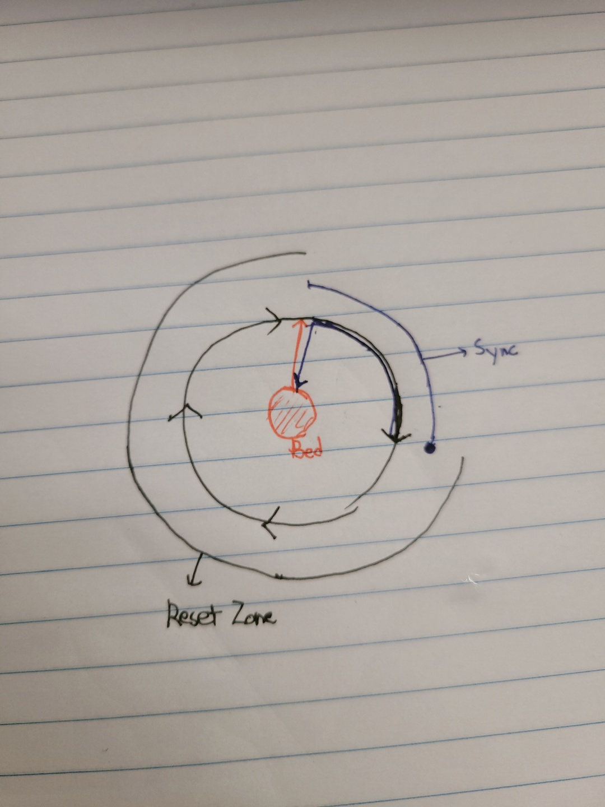
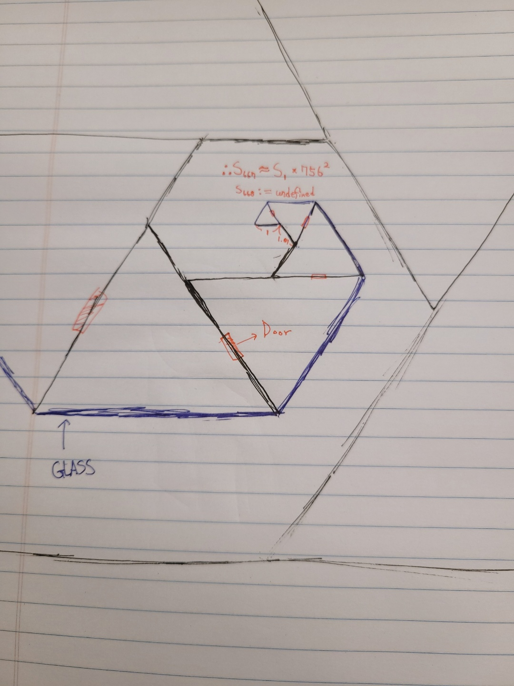
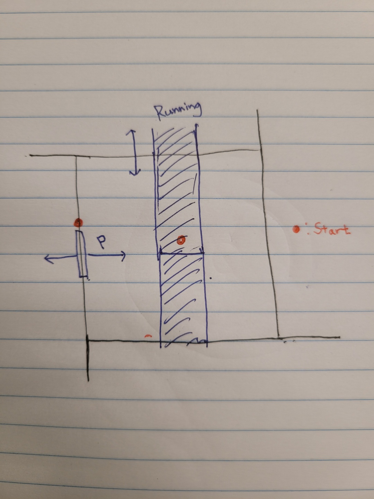

# The Tower

## Why

- 23대 빙궁주와 나반존자의 접점이 밤비노이아라 불리는 사막에 있었다.
  - 뭍혀 있던 커다란 돌멩이는 석문의 일부분이었다.
  - 쪼개진 석문에서 나반존자와 23대 빙궁주의 흔적을 찾을 수 있었다.
- 그 근처에 있는 커다란 얼음탑은 세계 7대 불가사의에 속한다.
  - 현재 탑 내부는 빈 공간이다.
  - 그곳 아래에서 출토된 의미불명의 문서들이 신화적 허구를 더하기 위한 것이라는 정설이 부정될 수 있다.
    - 실제인물인 나반존자와 23대 빙궁주와 관련이 있을 수 있기 때문
- 위 문서를 그대로 받아들이면 다소 판타지적으로 서술되어있는 `내부`는 **탑의 내부**일 확률이 높다.
- 이는 새로운 역사적 패러다임을 제시하는데 있어중요한 역할을 할 것이다.
- 하여, 해석한 문서를 토대로 예상지도를 그려보았다.
- 기록에는 4층 이후가 언급되어있으나 구체적 묘사는 존재하지 않았다.

## First Floor

- 시작지점인 침대가 자리한 영역에서 흙길로 이동할 수 있다.
- 일정 거리를 지나게 되면, 흙길의 시작점과 연결된다. 연결 이후 부터는 시간이 되돌려진다.
  - 따라서, 같은 풍경이 반복되는 거리가 무한히 반복된다.
- 뒤로 돌아가게 되면 시간이 되돌려지지 않는 지점의 끝에서 시작지점으로 이동한다.

## Second Floor

- 안쪽 면은 얼음벽, 바깥면은 거울, 다른 방과 이어진 면에는 문이 있다.
- 기록에 따르면 668개의 방이 있었다. 하지만 668번째 방에 대한 묘사는 존재하지 않았다.
- 한 면의 폭이 이전 방보다 1.1 배씩 커진다. ~~내가 그림을 못그려서 문제지.~~

## Third Floor

- 높이가 없는 직육면체의 방에 두 개의 측정기가 있다.
- 힘과 달리기 속력을 측정했을 것이다.
- 특정 조건을 넘기지 못하면 벽이 점점 다가오며 방이 줄어드는 구조다.