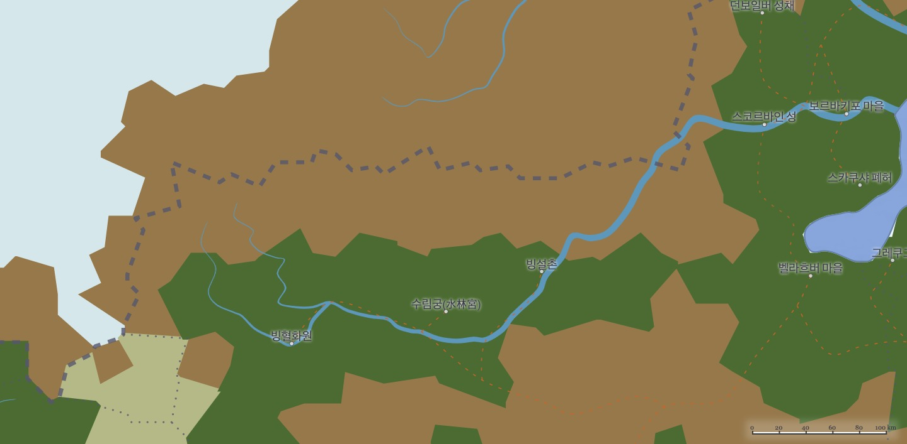

# 요투운 수림지방의 전성기에 대한 고찰

학번: 112345561

이름: 한지나

날짜: 1963-09-31

## 서론 및 요약

기원전 2000년 전부터 1000년 전까지 대부분의 기록은 소실 되었지만,
최근 새롭게 도입된 방사성 에테르 연대 측정법으로 당시 기후나 지질정보를 미루어 짐작할 수 있게 되었다.
방사성 에테르 연대 측정법의 정확성은 윌러드 리비연구팀의 논문[1](#_1)에 따르면, ±30년 가량이므로,
그 과정에서 23대 빙궁주의 기록서[2](#_2)를 참고 하여 세세한 조정을 거쳤다.

_녹색: 타이가, 갈색: 툰드라 지역_

현 세계유형문화재 5호로 지정된 수림궁이 당시에는 정치적 요충지였을 거[3](#_3)라는 설에 의해, 빙혈화원이라 일컬어지는 곳은 일반적으로 호족세력들의 은신처라고 예상하지만,
당시 지리적위치를 볼 때 수림궁은 지방관사의 역할 정도를 해냈을 것으로 보인다. 또 빙혈화원은 실제 누군가 살고 있는 지역이 아닌 자연경관일 것이며,
궁주의 별장이나 실제 꽃밭이었을 가능성이 농후하다. 그러므로 기원전 1200년 전부터 1000년 전까지의 기록을 전면적으로 수정해야할 것을 제안하는 바이다.

## 본론

[54, 52, 117, 53, 55, 73, 117, 103, 55, 74, 50, 48, 73, 79, 121, 100, 116, 67, 68, 113, 117, 73, 68, 115, 110, 89, 81, 103, 54, 55, 79, 48, 54, 114, 79, 103, 73, 79, 121, 101, 105, 79, 117, 76, 112, 79, 117, 112, 116, 67, 119, 75, 54, 52, 75, 89, 54, 52, 113, 85, 73, 79, 121, 100, 116, 79, 117, 118, 117, 67, 68, 115, 110, 98, 81, 103, 55, 73, 83, 52, 55, 73, 79, 66, 55, 74, 101, 81, 73, 79, 121, 88, 104, 117, 121, 100, 104, 67, 68, 113, 115, 111, 80, 115, 110, 98, 84, 114, 105, 54, 81, 117]

_(...이후 내용이 손상되어 글자가 보이지 않는다.)_

## 결론

[54, 114, 101, 52, 54, 53, 79, 107, 55, 74, 50, 65, 73, 79, 113, 51, 117, 79, 117, 70, 103, 79, 121, 90, 103, 67, 68, 113, 116, 73, 68, 114, 111, 75, 106, 114, 107, 74, 119, 103, 54, 114, 105, 119, 54, 54, 71, 100, 55, 74, 50, 69, 73, 79, 121, 103, 104, 79, 117, 50, 103, 67, 68, 114, 112, 53, 68, 115, 104, 111, 122, 116, 108, 90, 106, 113, 117, 76, 65, 103, 55, 73, 117, 99, 55, 74, 54, 82, 55, 90, 97, 73, 54, 52, 117, 107]

_(...이후 내용이 손상되어 글자가 보이지 않는다.)_

[4](#_4)

## Reference

### 1

윌러드 리비, 방사성 에테르의 반감기를 이용한 연대 측정법, 1954-01-23. 3p - 5p

### 2

요투운실록: 여괴의 지배는 백성을 널리 이롭게 하였다. 10p-24p

### 3

첸 위안, "잊혀진 고대왕국, 요투운" 1961년 출판됨.

### 4

[55, 75, 101, 69, 55, 73, 117, 107, 55, 74, 50, 65, 73, 79, 113, 51, 117, 67, 68, 115, 108, 114, 84, 114, 108, 113, 81, 103, 55, 74, 97, 48, 54, 53, 71, 103, 54, 52, 43, 69, 73, 79, 113, 119, 103, 79, 117, 109, 116, 67, 68, 115, 105, 74, 103, 103, 55, 74, 101, 71, 54, 52, 117, 107]

_(...이후 내용이 손상되어 글자가 보이지 않는다.)_
